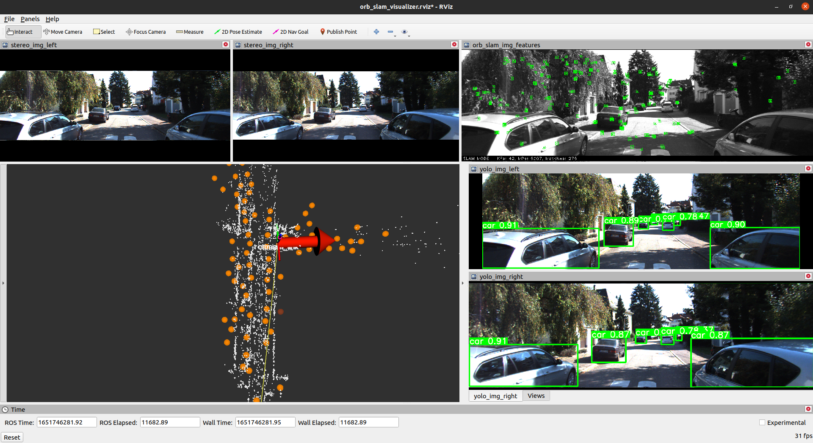
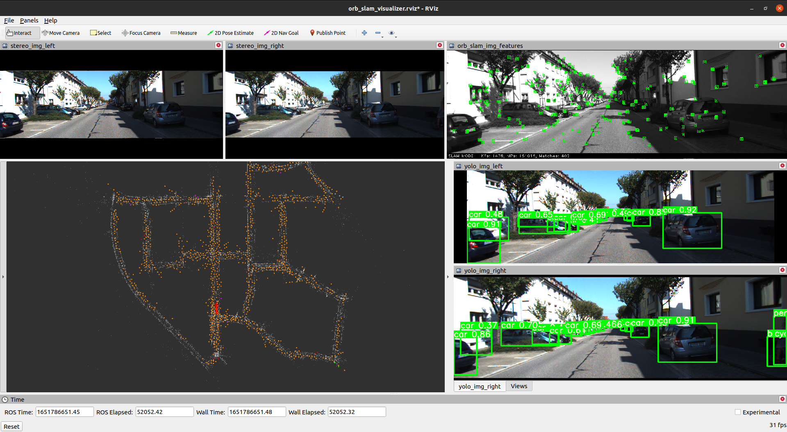
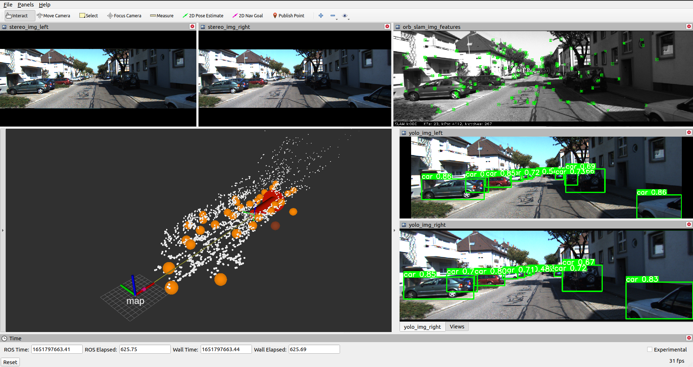
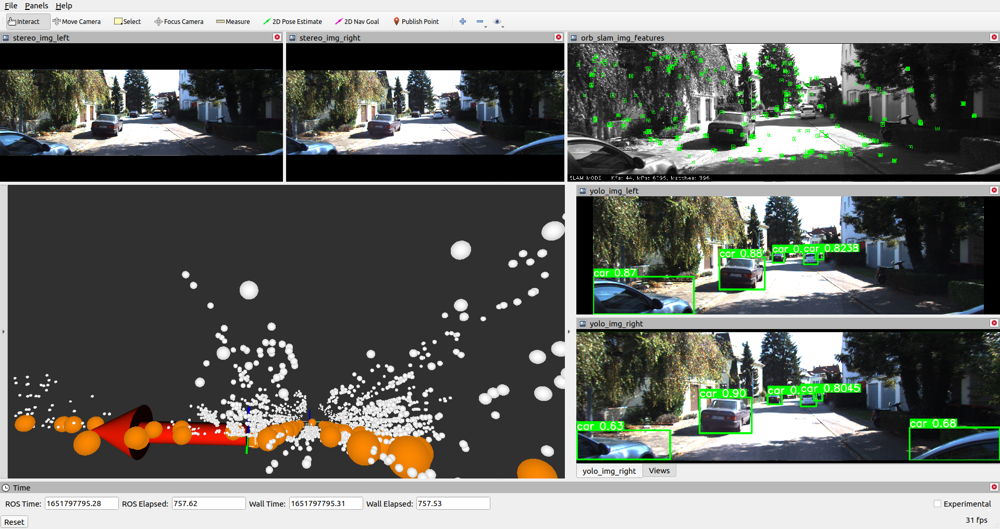
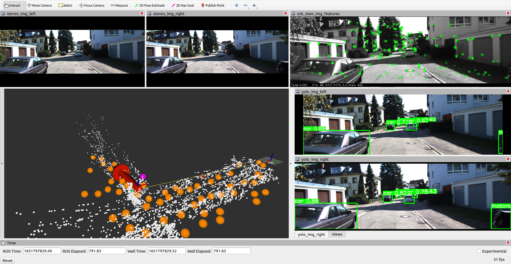

# Learning in Robotics (ESE 650) - Final Project: Semantic Slam
In this project, we incorporate semantic information extracted from object detection model YOLOv5 into the
whole pipe line of stereo ORB-SLAM2 to associate the landmarks with semantic information. The position and semantic
information from YOLOv5 are employed for landmark initialization and landmark semantic labeling. Meanwhile, a Bayesian
update rule is implemented to guarantee more accurate semantic label association to the landmark. ORB-SLAM2 provides the
necessary and reliable mapping and localization information for data association. The evaluation of our method is performed
on the KITTI stereo dateset sequence 00. In the end, a 3D points map with landmarks associated with semantic labels is built.

## Installation
The whole pipeline is run with ROS Noetic so first you need to create a workspace. Then clone this repository in the src directory of your catkin workspace. Since this repository has some nested repositories (eg. orb_slam_2), we need to clone with the ```recursive``` parameter so that it also clones the submodules. Lastly, since we want to clone this inside the src directory, we specify the relative path so that we don't clone the contents into a subdirectory called ese650-final-project (the name of this GitHub repo).
```bash
mkdir -p ~/sem_slam_ws/src/
cd ~/sem_slam_ws/src/
git clone --recursive https://github.com/orlando21lara/ese650-final-project.git ./
cd ~/sem_slam/
catkin_make
```

### Notes on dependencies in submodules
The submodules that we have included are forked repositories to which we have made some slight changes.

In ORB-SLAM2 we added some configuration launch files including camera parameteres for the KITTI dataset. Also in case there is an OpenCV installation on your machine that differs from the version of OpenCV that ROS installs, then you must specify the path to the version that ROS uses. This is specified in line 33 of the CMakeLists.txt file.

As for the kitti player forked repo, we made some changes to fix the compilation errors that occur when cloning the orginal repo. These fixes were metioned in a pull request from the original repo. To be able to run the kitti_dataset player, you need to have the raw data corresponding to sequence 00 of the KITTI odometry dataset. You could also use any other raw data but you must specify its path in the ```kittiplayer_sync.launch``` launch file.

## Running
To visualize everything you must run roscore and rviz. Inside rviz load the provided configuration file: ```your-catkin-workspace/src/rviz_config_files/orb_slam_visualizer.rviz```
Then you have to run a total of four different launch files to run: ORB-SLAM2, the kitti dataset player, YOLO_V5, and the semnatic slam implementation.

**For the kitti player and the semantic slam nodes, you also need to actitate a conda virtual environement before running their respective launch file.**
```bash
roslaunch orb_slam2_ros orb_slam2_kitti_stereo.launch
roslaunch kitti_player kittiplayer_sync.launch
roslaunch ros_yolo yolo_kitti_stereo.launch
roslaunch semantic_slam semantic_slam.launch
```

## Results
Here are a few images from the obtained results. In these images the red arrow corresponds to the current pose of the driving car while the white dots are the projected feature points provided by ORB-SLAM2. In the top left, we can see the left and right stereo images that are input into the pipeline at that point in time and on the right we can see the outputs from the ORB-SLAM node and the YOLO predictions. The semantic labels that are projected into the 3D space as colored points with the following meanings:

Color  | Label
------ | -----------
Red    | Person
Blue   | Bicycle
Orange | Car
Pink   | Motorcycle
Brown  | Bus
Teal   | Truck








